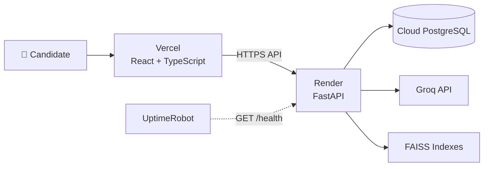
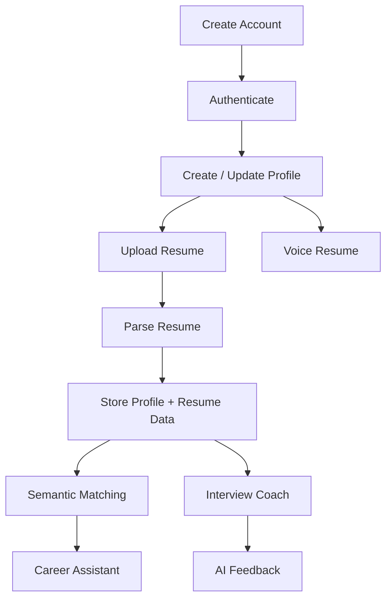

<div align="center">

# 🟠 AI Career Companion Agent for Internship Matching and Interview Preparation 🟠

<a href="https://readme-typing-svg.demolab.com/">
  
</a>

<br/>

<p>
  <strong>Career Match AI</strong> is a full-stack AI career companion that connects
  resume intelligence, internship matching, career assistance, cover-letter generation,
  interview preparation, and voice-based resume creation in one experience.
</p>

<br/>

<a href="#-key-features">
  
</a>
<a href="#-architecture">
  
</a>
<a href="#-getting-started">
  
</a>

<br/><br/>


<br/><br/>

**Made with ♥ by Madireddy Meena Mahanth Hariandh**

</div>

---

## 📌 Quick Links

[Overview](#-about-career-match-ai) •
[Features](#-key-features) •
[Architecture](#-architecture) •
[Tech Stack](#-technology-stack) •
[Getting Started](#-getting-started) •
[Deployment](#-production-deployment) •
[Project Structure](#-project-structure) •
[Roadmap](#-roadmap)

---

## 🧠 About Career Match AI

**Career Match AI** is a full-stack career-preparation application for students and early-career candidates.

The platform brings together the candidate's profile, resume, opportunities, conversations, and interview preparation so that each feature can work from the same career context.

```text
                           CAREER MATCH AI
                                  │
                 ┌────────────────┼────────────────┐
                 │                │                │
                 ▼                ▼                ▼
          Resume Intelligence  Opportunity     Career Assistant
                 │             Matching               │
                 └────────────────┬───────────────────┘
                                  ▼
                           Interview Coach
                                  │
                                  ▼
                            Voice Resume
                                  │
                                  ▼
                         Career Readiness
```

---

## ✨ Key Features

| Capability | What it does |
| :--- | :--- |
| 🔐 **Authentication** | Register, login, protected routes, JWT-based authentication, password change/reset flows, and user-specific data access. |
| 📄 **Resume Intelligence** | Upload PDF/DOCX resumes and extract structured information such as skills, education, projects, experience, certifications, and profile details. |
| 🎯 **Opportunity Match** | Retrieve relevant internship opportunities using embeddings, FAISS-based semantic similarity, profile alignment, and AI-generated explanations. |
| ✉️ **Cover Letter Studio** | Generate personalized cover letters from the selected resume and internship opportunity. |
| 💬 **Career Assistant** | Ask career questions through a profile-aware assistant backed by a career knowledge base and semantic retrieval. |
| 🎤 **Interview Coach** | Run role-focused interview preparation, multi-turn mock interviews, technical/HR questions, scoring, feedback, and preparation guidance. |
| 📚 **Interview Document Q&A** | Upload interview-related documents and ask questions grounded in their extracted content. |
| 🎙️ **Voice Resume** | Capture spoken information, process multilingual input, structure the content into resume sections, and export an ATS-ready PDF. |
| 🌓 **Dark + Light Mode** | Persistent theme switching with a custom orange/charcoal visual identity in both themes. |
| 📱 **Responsive UI** | Designed for desktop, tablet, and mobile breakpoints. |

---

# 🏗️ Architecture

Career Match AI uses a single frontend, a single FastAPI backend, a cloud relational database for persistent application data, local/bundled FAISS indexes for semantic retrieval, and Groq as the LLM provider.


```mermaid
flowchart LR
    C[👤 Candidate] --> V[Vercel<br/>React + TypeScript]
    V -->|HTTPS API| R[Render<br/>FastAPI]

    R --> P[(Cloud PostgreSQL)]
    R --> G[Groq API]
    R --> F[FAISS Indexes]

    U[UptimeRobot] -. GET /health .-> R
```

### Core data flow


```mermaid
flowchart TD
    A[Create Account] --> B[Authenticate]
    B --> C[Create / Update Profile]
    C --> D[Upload Resume]
    D --> E[Parse Resume]
    E --> F[Store Profile + Resume Data]
    F --> G[Semantic Matching]
    G --> H[Career Assistant]
    F --> I[Interview Coach]
    I --> J[AI Feedback]
    C --> K[Voice Resume]
```

> **Storage note:** the repository supports a local SQLite fallback for development through `DATABASE_URL`, while production should use a managed PostgreSQL connection. Resume/interview uploads currently use the repository's local `uploads/` workspace, so persistent production document storage should be validated before a public multi-user deployment.

---

## 🧩 Technology Stack

| Layer | Technology |
| :--- | :--- |
| **Frontend** | React 19, TypeScript, Vite |
| **UI** | Tailwind CSS 4 + custom CSS design system |
| **Routing** | React Router 7 |
| **Backend** | Python 3.10+, FastAPI |
| **ORM** | SQLAlchemy |
| **Database** | PostgreSQL for production; SQLite fallback for local development |
| **Authentication** | JWT + password hashing |
| **LLM** | Groq API |
| **Embeddings** | Sentence-Transformers — `all-MiniLM-L6-v2` |
| **Semantic Retrieval** | FAISS |
| **Resume Parsing** | `pdfplumber` + `python-docx` |
| **PDF Generation** | jsPDF |
| **Frontend Hosting** | Vercel |
| **Backend Hosting** | Render |
| **Monitoring** | UptimeRobot |
| **API Docs** | FastAPI Swagger / OpenAPI |

---

# 🎨 UI / UX Design

Career Match AI deliberately moves away from the common purple/violet AI-dashboard look.

## 🟠 Brand Direction

**Warm Orange + Charcoal + Cream**

The design language focuses on:

- intelligent
- warm
- premium
- modern
- calm
- technical
- human

### Dark Mode

```text
Background        #0B0908
Surface           #12100F
Elevated          #201A16
Border            #2D2520

Primary Orange    #D97757
Bright Orange     #F28B68
Soft Orange       #FFB08E

Success           #3FD39B
Warning           #F3B45B
Error             #F06A6A

Primary Text      #F8F4F0
Secondary Text    #B9ADA5
Muted Text        #776D66
```

### Light Mode

```text
Background        #FAF7F4
Surface           #FFFFFF
Secondary Surface #F5EFEB
Border            #E8DDD5

Primary Orange    #C75F3F
Bright Orange     #DB704E
Soft Orange       #F3B49A

Success           #168A68
Warning           #B86E18
Error             #C8444F

Primary Text      #241B17
Secondary Text    #665952
Muted Text        #92857D
```

The interface uses subtle borders, controlled accent color, modern typography, responsive layouts, and restrained motion instead of oversized gradients or excessive glass effects.

---

# 🖥️ Product Areas

### 🏠 Dashboard

A central career overview with:

- career-readiness signals
- resume/profile status
- recommended next actions
- top opportunity matches
- AI career insights
- recent activity

### 📄 Resume Intelligence

- resume upload
- resume parsing
- structured information extraction
- skills
- education
- projects
- experience
- certifications
- profile signals

### 🎯 Opportunity Match

- internship discovery
- semantic retrieval
- match percentages
- skill alignment
- profile compatibility
- explainable match reasoning

### 💬 Career Assistant

- profile-aware career questions
- knowledge-base retrieval
- contextual AI responses
- conversation interface

### 🎤 Interview Coach

- technical questions
- HR/behavioral questions
- multi-turn interview sessions
- candidate responses
- AI evaluation
- feedback
- preparation guidance

### 🎙️ Voice Resume

```text
Speak
  ↓
Transcribe
  ↓
Process / Translate
  ↓
Structure
  ↓
Generate Resume
  ↓
Export PDF
```

### ✉️ Cover Letter Studio

Create a role-specific cover letter from the user's resume and selected opportunity.

---

# 📁 Project Structure

This tree reflects the **current repository layout** rather than a generic `backend/` package layout:

```text
Career-Match-AI-Redesigned/
│
├── app/
│   ├── __init__.py
│   ├── main.py
│   ├── auth.py
│   ├── database.py
│   ├── dependencies.py
│   ├── models.py
│   ├── schemas.py
│   │
│   ├── candidate_preprocessor.py
│   ├── cover_letter_service.py
│   ├── embeddings.py
│   ├── generate_internships.py
│   ├── internship_index.py
│   ├── internship_preprocessor.py
│   ├── interview_agent_service.py
│   ├── interview_document_service.py
│   ├── llm_ranker.py
│   ├── parser.py
│   ├── resume_parser.py
│   ├── utils.py
│   ├── voice_resume_service.py
│   │
│   ├── internships.json
│   │
│   ├── rag/
│   │   ├── __init__.py
│   │   ├── generator.py
│   │   ├── ingest.py
│   │   └── retriever.py
│   │
│   └── routers/
│       ├── auth.py
│       ├── career_assistant.py
│       ├── cover_letter.py
│       ├── interview_agent.py
│       ├── profile.py
│       ├── resume.py
│       └── voice_resume.py
│
├── data/
│   ├── internships.json
│   ├── internship_index.faiss
│   ├── internship_metadata.json
│   └── rag/
│       ├── index.faiss
│       └── metadata.json
│
├── frontend/
│   ├── public/
│   │   ├── favicon.svg
│   │   ├── icons.svg
│   │   ├── logo-cma.svg
│   │   ├── logo.png
│   │   └── chatbot.png
│   │
│   ├── src/
│   │   ├── api/
│   │   │   ├── auth.ts
│   │   │   ├── careerAssistant.ts
│   │   │   ├── client.ts
│   │   │   ├── coverLetter.ts
│   │   │   ├── interviewAgent.ts
│   │   │   ├── profile.ts
│   │   │   ├── resume.ts
│   │   │   ├── types.ts
│   │   │   └── voiceResume.ts
│   │   │
│   │   ├── components/
│   │   ├── context/
│   │   ├── pages/
│   │   ├── sections/
│   │   ├── utils/
│   │   ├── App.tsx
│   │   ├── config.ts
│   │   ├── index.css
│   │   └── main.tsx
│   │
│   ├── .gitignore
│   ├── package.json
│   ├── package-lock.json
│   ├── vercel.json
│   └── vite.config.ts
│
├── knowledge_base/
│   ├── career_companion_knowledge.md
│   └── career_companion_knowledge.docx
│
├── uploads/
│   └── .gitkeep
│
├── .env.example
├── .gitignore
├── documentation.md
├── Procfile
├── railway.json
├── requirements.txt
├── LICENSE
└── README.md
```

---

# 🚀 Getting Started

## Prerequisites

Install:

- Python 3.10+
- Node.js compatible with the Vite version in `frontend/package.json`
- npm
- A Groq API key

For production deployment, use a managed PostgreSQL database.

---

## 1. Backend Setup

Run backend commands **from the repository root only after entering `app`'s parent project directory used by the server**. In the current repository, `app/` is at the project root, so use:

### Windows PowerShell

```powershell
python -m venv .venv
.\.venv\Scripts\Activate.ps1
pip install -r requirements.txt
Copy-Item .env.example .env
```

### macOS / Linux

```bash
python3 -m venv .venv
source .venv/bin/activate
pip install -r requirements.txt
cp .env.example .env
```

Edit `.env`:

```env
GROQ_API_KEY=your_groq_api_key_here
DATABASE_URL=sqlite:///./resume_parser.db
```

For local development, the current backend can use the SQLite fallback.

Start the API:

```bash
python -m uvicorn app.main:app --reload --host 127.0.0.1 --port 8000
```

Backend:

```text
http://127.0.0.1:8000
```

Swagger:

```text
http://127.0.0.1:8000/docs
```

---

## 2. Frontend Setup

Open a second terminal:

```powershell
cd frontend
npm install
```

Use the frontend environment template when present:

```text
frontend/.env.example
```

Set:

```env
VITE_API_BASE_URL=http://127.0.0.1:8000
```

Then:

```bash
npm run dev
```

Frontend:

```text
http://127.0.0.1:5173
```

Create a production build:

```bash
npm run build
```

---

# 🔐 Environment Variables

## Backend

| Variable | Purpose |
| :--- | :--- |
| `DATABASE_URL` | Database connection string. Use managed PostgreSQL in production; the current code falls back to SQLite locally. |
| `GROQ_API_KEY` | Server-side Groq credential used by AI features. |
| `GROQ_MODEL` | Optional Groq model override if supported by the current service configuration. |
| `JWT_SECRET_KEY` | Recommended production secret for JWT signing when the backend is configured to use environment-based secrets. |

### Important

Never put:

- `DATABASE_URL`
- database passwords
- Groq API keys
- JWT secrets

inside frontend environment variables.

Never commit `.env` files.

---

## Frontend

```env
VITE_API_BASE_URL=http://127.0.0.1:8000
```

Production example:

```env
VITE_API_BASE_URL=https://YOUR-RENDER-SERVICE.onrender.com
```

---

# ☁️ Production Deployment

Target architecture:

```text
Vercel
  │
  │ HTTPS
  ▼
Render
  │
  ├── FastAPI
  ├── Cloud PostgreSQL
  └── Groq API

UptimeRobot
  │
  └── GET /health
```

## 🟠 Render — Backend

The backend is intended to run as a single FastAPI Web Service.

Production start command:

```bash
uvicorn app.main:app --host 0.0.0.0 --port $PORT
```

Health endpoint:

```text
GET /health
```

The current repository's production deployment configuration should be validated before launch because it currently contains a `Procfile` and `railway.json`, but no `render.yaml`.

Recommended Render environment variables:

```env
DATABASE_URL=YOUR_CLOUD_POSTGRESQL_URL
GROQ_API_KEY=YOUR_GROQ_API_KEY
GROQ_MODEL=YOUR_GROQ_MODEL
JWT_SECRET_KEY=YOUR_STRONG_SECRET
FRONTEND_URL=https://YOUR-VERCEL-DOMAIN
CORS_ORIGINS=https://YOUR-VERCEL-DOMAIN
```

---

## ▲ Vercel — Frontend

Set the Vercel project root to:

```text
frontend/
```

Build:

```bash
npm run build
```

Output directory:

```text
dist/
```

Set:

```env
VITE_API_BASE_URL=https://YOUR-RENDER-SERVICE.onrender.com
```

The repository already contains:

```text
frontend/vercel.json
```

for SPA route rewriting.

---

## ❤️ UptimeRobot

Use the existing FastAPI application health route:

```text
https://YOUR-RENDER-SERVICE.onrender.com/health
```

The health endpoint should remain lightweight and should not trigger:

- Groq calls
- resume parsing
- FAISS searches
- heavy AI inference
- authentication requirements

No second FastAPI service is required for monitoring.

---

# 🗄️ Database

### Local development

The current code supports:

```text
SQLite
```

through:

```env
DATABASE_URL=sqlite:///./resume_parser.db
```

### Production

Use:

```text
Managed Cloud PostgreSQL
```

with:

```env
DATABASE_URL=postgresql://...
```

The existing SQLAlchemy layer already abstracts database access through `app/database.py`.

> **Production note:** the current repository still contains SQLite as its default fallback and local `uploads/` paths. Before a public launch, verify the production branch/configuration explicitly prevents unintended SQLite use and does not rely on ephemeral Render storage for permanent user documents.

---

# 🧪 Verification / Release Checklist

The following is a **release checklist, not a claim that every item has already been verified**.

```text
[ ] Frontend production build passes
[ ] Backend production startup passes
[ ] PostgreSQL production connection verified
[ ] Registration verified against production database
[ ] Login verified
[ ] Protected routes verified
[ ] Resume upload verified
[ ] PDF resume parsing verified
[ ] DOCX resume parsing verified
[ ] Internship matching verified
[ ] Career Assistant verified
[ ] Cover letter generation verified
[ ] Interview Coach verified
[ ] Interview document Q&A verified
[ ] Voice Resume verified
[ ] Vercel deployment verified
[ ] Render deployment verified
[ ] Vercel → Render communication verified
[ ] CORS verified
[ ] /health returns HTTP 2xx
[ ] UptimeRobot monitor verified
[ ] Production secrets kept out of Git
[ ] Mobile layout verified
[ ] Dark mode verified
[ ] Light mode verified
```

---

# 🛣️ Roadmap

## ✅ Implemented in the repository

- [x] JWT authentication flows
- [x] Protected React routes
- [x] PDF resume processing
- [x] DOCX resume processing
- [x] Internship semantic retrieval
- [x] FAISS internship index
- [x] Groq-powered AI features
- [x] RAG career assistant components
- [x] Multi-turn interview agent
- [x] Interview document processing
- [x] Voice resume workflow
- [x] Resume PDF export
- [x] Responsive frontend
- [x] Persistent dark/light theme preference

## 🔮 Future / production hardening

- [ ] Finalize managed PostgreSQL production configuration
- [ ] Finalize persistent production document storage
- [ ] Finalize Render-specific deployment configuration
- [ ] Complete end-to-end production verification
- [ ] Expand internship dataset
- [ ] Expand career knowledge base
- [ ] Add richer career analytics

---

# 🔒 Security Principles

Career Match AI should follow a backend-first secret-management model.

Never expose the following in the frontend:

```text
GROQ_API_KEY
DATABASE_URL
JWT_SECRET_KEY
database passwords
private credentials
```

Use environment variables and server-side configuration.

For production, uploaded documents should be stored using a persistence strategy that survives backend restarts and redeployments.

---

# ⚠️ Disclaimer

> **Career Match AI provides AI-assisted career guidance, resume assistance, internship-matching insights, and interview practice. Generated content and recommendations are decision-support tools and should be reviewed before professional use. They are not guarantees of internship selection, employment, or interview outcomes.**

---

<div align="center">

## 🟠 Career Match AI

**Find where your skills belong.**

<br/>

### Made with ♥ by **Madireddy Meena Mahanth Hariandh**

<br/>


</div>
